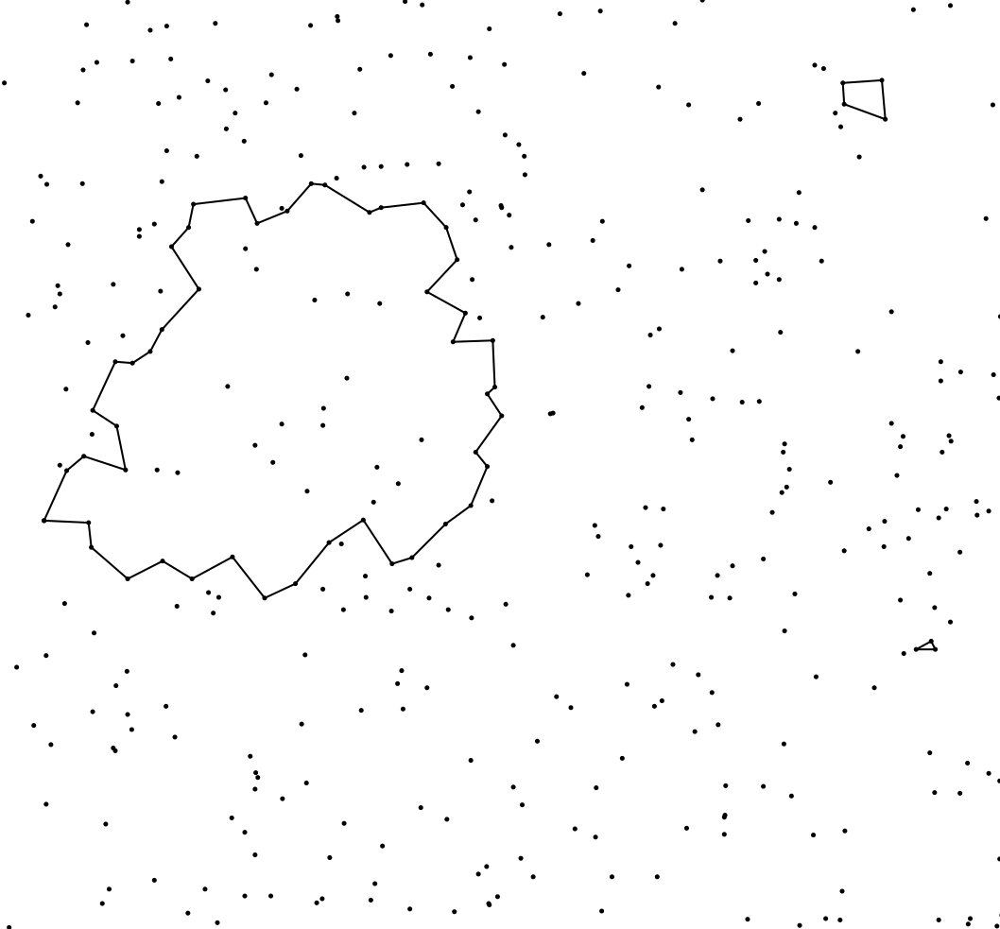

# Extremal life times of persistent loops and holes

When analyzing persistent homology, practitioners often look for features living for exceptionally long periods of time, and then draw conclusions if they do occur. However, how can we decide whether the observed long life times come from genuinely interesting phenomena and are not a mere incarnation of chance?

</a>

To answer this question, we need to understand how long life times behave under the null model of complete spatial randomness, i.e., a Poisson point process. In this regard, a [breakthrough was achieved](https://projecteuclid.org/euclid.aoap/1504080025), where the order of the longest life time occurring in a large window was determined on a multiplicative scale. Despite the significance of this discovery, it is still difficult to build a rigorous statistical test, knowing only the order of the life time.

In a [recent preprint]() with [Nicolas Chenavier](http://www-lmpa.univ-littoral.fr/~chenavier/), we move one step closer to statistical applications and establish Poisson approximation results for extremal life times of loops and holes in large sampling windows. In the present [notebooks](sim.ipynb), we illustrate how to extract the loops with maximal life time in a two-dimensional setting.

